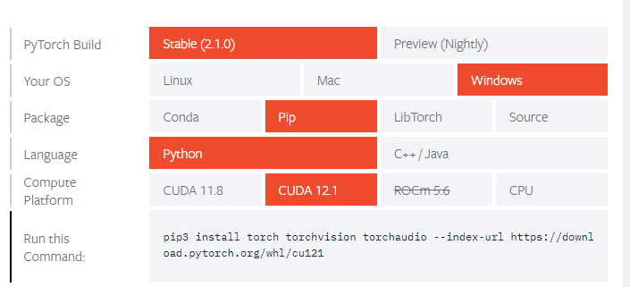
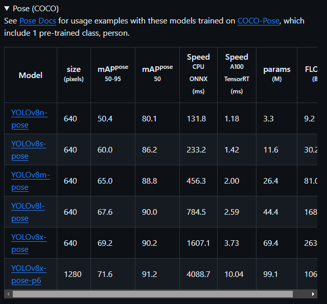

# KI-basierte Erkennung von Bewegungen

## Voraussetzungen


- **Python:** Version >= 3.8
- **PyTorch:** Version >= 1.8

Hatte bei mir WSL2 Ubunutu 22 auf Win10 (sollte jedoch auf ähnlichen Systemen funktionieren)



## Installation Yolov8

```bash
conda create -n motionbert python=3.7 anaconda
conda activate motionbert
# Please install PyTorch according to your CUDA version.
conda install pytorch torchvision torchaudio pytorch-cuda=11.6 -c pytorch -c nvidia
pip install -r requirements.txt
pip install ultralytics
```

## Erster Test

Um sicherzustellen, dass alles korrekt installiert wurde, führen Sie den folgenden Befehl aus:

```
yolo predict model=yolov8n.pt source='https://ultralytics.com/images/bus.jpg'
```

Die Modellcheckpoints werden automatisch heruntergeladen. 

## Inference Yolov8

```
python main.py
```

Generiert keypoints.json

## Inference MotionBert

Optionen müssen angepasst werden

keypoints.json werden von yolov8 benötigt

```
python infer_wild.py \
--vid_path test.mp4 \
--json_path keypoints.json \
--out_path /output
```

## Pose Estimation Modelle

Hier finden Sie eine Auflistung aller Pose Estimation Modelle:



Die oberen Modelle sind in der Regel schneller, aber möglicherweise ungenauer.

Um eine Inference mit einem anderen Bild oder Video zu starten, ersetzen Sie einfach den Wert in `source=''` und passen Sie gegebenenfalls das Modell an:

yolo predict model=yolov8n-pose.pt source=test.mp4